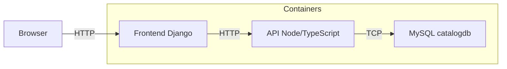

# Manual de despliegue y uso — Proyecto IB

Este repositorio contiene una API en Node.js/TypeScript, un frontend sencillo en Django y una base de datos MySQL. Aquí explico cómo ejecutar el laboratorio, probarlo y qué hace cada componente, con instrucciones claras y prácticas.

**Resumen rápido**
- API: `api/` (Express + TypeScript). Endpoint principal: `/api/catalogo`.
- Frontend: `web/` (Django) que consume la API y muestra la tabla.
- Base de datos: MySQL 8.0 con script inicial en `api/db/init.sql`.
- Orquestación: `docker-compose.yml` (levanta `db`, `api`, `web`).

**Requisitos**
- Docker Desktop y `docker-compose` (o Docker Compose v2 integrado).
- Node.js (para ejecución local opcional) y Python 3.13 (para el frontend local).

**Ejecutar con Docker (recomendado)**

1. En la raíz del proyecto, levantar los servicios:

```bash
docker-compose up --build -d
```

2. Verificar que los servicios estén arriba:

```bash
docker ps
```

3. Probar el endpoint de la API:

```bash
curl http://127.0.0.1:3000/api/catalogo
```

## Proyecto IB — Entrega de laboratorio

**Autor:** Irving Barria

**Fecha:** 2026-06-14

1. Resumen
----------
Este repositorio implementa el laboratorio solicitado: una API REST en Node.js/TypeScript organizada con principios de Clean Architecture, un frontend en Django que consume la API y una base de datos MySQL con script de inicialización. El proyecto puede ejecutarse localmente y mediante Docker Compose.

2. Entregables
--------------
- `docker-compose.yml`: orquestación de los tres servicios (`db`, `api`, `web`).
- `api/`: código fuente TypeScript, `Dockerfile` y `db/init.sql`.
- `web/`: frontend Django con la aplicación `core/` (vistas, servicios y plantillas).

3. Requisitos
-------------
- Docker Desktop (o Docker Engine con Compose v2).
- Opcional: Node.js y Python si se ejecuta en local.

4. Ejecución (Docker) — instrucciones para el profesor
----------------------------------------------------

1) Levantar servicios:

```bash
docker-compose up --build -d
```

2) Verificar contenedores:

```bash
docker ps
```

3) Comprobaciones básicas:

```bash
curl -s http://127.0.0.1:3000/health
curl -s http://127.0.0.1:3000/api/catalogo
```

4) Acceder al frontend:

http://127.0.0.1:8000

Para reinicializar la base de datos (eliminar datos y volver a ejecutar `init.sql`):

```bash
docker-compose down -v
docker-compose up --build -d
```

5. Ejecución alternativa (sin Docker)
-----------------------------------

API:

```bash
cd api
npm install
npm run build
node dist/app.js
```

Frontend:

```bash
cd web
python -m venv .venv
.venv\Scripts\activate  # Windows
pip install -r requirements.txt
python manage.py runserver 0.0.0.0:8000
```

6. Arquitectura y esquema del proyecto
-------------------------------------

- `api/` sigue una separación por capas (`domain`, `usecases`, `infra`, `presentation`).
- `web/` proporciona una vista que consume la API y renderiza una tabla HTML con los productos.
- `db` es MySQL con la tabla `catalog` (campos: `id`, `name`, `description`, `price`).

Diagrama de alto nivel:



7. Estructura de archivos (resumen)
----------------------------------

- `docker-compose.yml`
- `api/`
	- `Dockerfile`
	- `package.json`, `tsconfig.json`
	- `src/` (domain, usecases, infra, presentation)
	- `db/init.sql`
- `web/`
	- `Dockerfile`
	- `requirements.txt`
	- `manage.py`, `config/`, `core/` (templates, views, servicios)

8. Pruebas y comprobaciones
---------------------------

- `GET /health` debe responder con 200.
- `GET /api/catalogo` debe devolver el listado de productos en JSON.
- La plantilla del frontend debe mostrar correctamente los acentos.

9. Notas técnicas
-----------------

- La conexión a MySQL incorpora reintentos y `charset=utf8mb4` para evitar problemas de codificación.
- `api/db/init.sql` crea la base de datos y la tabla con `utf8mb4`. Si existen datos previos con codificación incorrecta, se aplicó una corrección puntual para transcodificar los valores en la tabla `catalog`.

10. Entrega y anexos
--------------------

Para la entrega se recomienda incluir:

1. El repositorio completo.
2. Una captura de pantalla del frontend mostrando la lista de productos.
3. (Opcional) Un archivo `entrega.txt` con nombre, matrícula y nota breve sobre la ejecución.

Si quieres que genere el archivo `entrega.txt` con tu nombre y matrícula, pásame los datos y lo añado.
